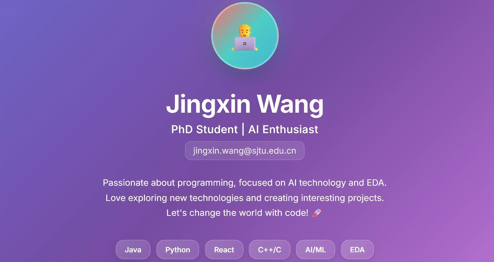

<!-- ## Hi there, I'm Jingxin Wang 👋 -->

  

---

## 📚 Research

### **GTAC**
**GTAC: A Generative Transformer for Approximate Circuits** 🔬 Under Review | [📄 Paper](#) | [💻 Code](https://github.com/959AI994/GTAC)

### **MixGate**
**Alignment Unlocks Complementarity: A Framework for Multiview Circuit Representation Learning** 📄 [Paper](https://arxiv.org/abs/2509.20968) | [💻 Code](https://github.com/959AI994/MixGate-ICLR)

### **AI4EDA Data Processing Toolkit**
A comprehensive open-source toolkit for EDA (Electronic Design Automation) data processing and format conversion, specifically designed for AI4EDA applications. [💻 Code](https://github.com/959AI994/AI4EDA-OpenABC-Data-Toolkit)

### **MLGSC**
**Multi-level Graph Subspace Contrastive Learning for Hyperspectral Image Clustering** 📄 [Paper](https://ieeexplore.ieee.org/abstract/document/10650148) | [💻 Code](https://github.com/959AI994/MLGSC)

### **Awesome-Hyperspectral-Image-Clustering**
A curated collection of papers and open-source codes on hyperspectral image clustering. [💻 Repository](https://github.com/GuanRX/Awesome-Hyperspectral-Image-Clustering)

---

## 💼 Projects

### **Shared Parking Software**
A WeChat mini-program and web application for shared parking solutions, built with Vue.js, Element UI, and integrated map functionality. [💻 Code](https://github.com/959AI994/Shared-Parking-Software-WeChat-App-and-Web)

### **Open-source Video Player (Android)**
A beautiful Tencent Video-like Android application based on Kotlin + Jetpack core components + coroutines + componentization. [💻 Code](https://github.com/959AI994/Open-source-video-player-Android-app)

### **react-hiui-chat**
A WeChat-like web application client built with React. [💻 Client](https://github.com/959AI994/react-hiui-chat) | [💻 Service](https://github.com/959AI994/react-hiui-chat-service)

### **Transport Management System**
A comprehensive cargo transportation management system. [💻 Code](https://github.com/959AI994/Software-Transport-Project)

---
