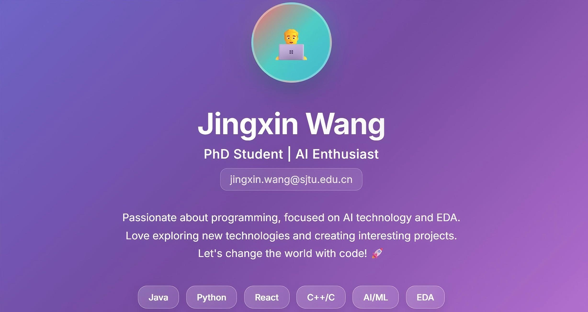

<!-- ## Hi there, I'm Jingxin Wang 👋 -->

  

---

## 📚 My Research Projects & Publications  

### 🔧 **AI4EDA Data Processing Toolkit(9 stars⭐)**
> [🌟One-step AIG/Verilog to PyG conversion for ML training🌟] A comprehensive open-source toolkit for EDA (Electronic Design Automation) data processing and format conversion, specifically designed for AI4EDA applications. Provides essential utilities for handling circuit datasets, benchmark conversions, and preprocessing pipelines to accelerate AI-driven chip design research.

🔗 [💻 Code](https://github.com/959AI994/AI4EDA-OpenABC-Data-Toolkit)

### 📖 **Awesome Hyperspectral Image Clustering(76 stars⭐)**
> A curated collection of papers and open-source codes on hyperspectral image clustering, serving as a comprehensive resource for researchers and practitioners in remote sensing and computer vision.

🔗 [💻 Repository](https://github.com/GuanRX/Awesome-Hyperspectral-Image-Clustering)

### 🔬 **GTAC: A Generative Transformer for Approximate Circuits**
> **[Under Review]** A novel generative transformer architecture designed to revolutionize approximate circuit design through advanced machine learning techniques, enabling efficient hardware optimization with controllable quality-power tradeoffs.

🔗 [📄 Paper](https://arxiv.org/abs/2601.19906) | [💻 Code](https://github.com/959AI994/GTAC)

### 🔬 **MixGate: A Framework for Multiview Circuit Representation Learning**
> **[Under Review]** Alignment Unlocks Complementarity: A Framework for Multiview Circuit Representation Learning that leverages multimodal alignment techniques to enhance circuit understanding and optimization through complementary perspectives.

🔗 [📄 Paper](https://arxiv.org/abs/2509.20968) | [💻 Code](https://github.com/959AI994/MixGate-ICLR)

### 🔬 **UniCircuit: Multimodal Circuit Representation Learning with Anchor-Free Alignment**
> **[DATE 2026]** UniCircuit is an anchorless multimodal circuit representation learning framework that aligns circuit representations using SVD to achieve robust QoR prediction and cross-modal semantic modeling.

🔗 [📄 Paper](#) | [💻 Code](#)

### 🔬 **MLGSC: Multi-level Graph Subspace Contrastive Learning for Hyperspectral Image Clustering**
> **[IJCNN 2024]** Multi-level Graph Subspace Contrastive Learning for Hyperspectral Image Clustering - A novel contrastive learning framework that exploits multi-level graph structures to enhance hyperspectral image analysis and clustering performance.

🔗 [📄 Paper](https://ieeexplore.ieee.org/abstract/document/10650148) | [💻 Code](https://github.com/959AI994/MLGSC)

---

## 💼 My Open-Source Projects

### 🎫 **PDD - Campus Ticketing System (Piao Duo Duo)**
> A comprehensive campus ticketing platform designed for university events and activities, providing seamless ticket booking, management, and distribution services. Built to streamline event organization and enhance student engagement with an intuitive user experience.

🔗 [💻 Code](https://github.com/cug-se-pdd/pdd)

### 🚗 **Shared Parking Software**
> A comprehensive WeChat mini-program and web application for shared parking solutions, built with modern web technologies including Vue.js and Element UI, featuring real-time map integration and intelligent parking slot management.

🔗 [💻 Code](https://github.com/959AI994/Shared-Parking-Software-WeChat-App-and-Web)

### 📱 **Open-source Video Player (Android)**
> A beautiful Tencent Video-like Android application based on Kotlin + Jetpack core components + coroutines + componentization architecture, demonstrating modern Android development best practices with smooth video streaming capabilities.

🔗 [💻 Code](https://github.com/959AI994/Open-source-video-player-Android-app)

### 💬 **A Chat System based on React**
> A WeChat-like web application client built with React, featuring real-time messaging, user-friendly interface, and seamless chat experiences with separate client and service architectures.

🔗 [💻 Client](https://github.com/959AI994/react-hiui-chat) | [💻 Service](https://github.com/959AI994/react-hiui-chat-service)

### 🚚 **Transport Management System**
> A comprehensive cargo transportation management system designed to streamline logistics operations, tracking, and resource allocation for efficient fleet management and delivery optimization.

🔗 [💻 Code](https://github.com/959AI994/Software-Transport-Project)

---
